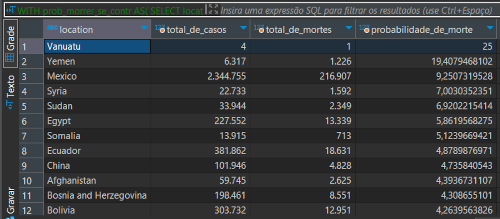

# Projeto do modulo SQL | Da Ultima school 📚

Projeto proposto pela Ultima School para testar nosso aprendizado com SQL, foram elaboradas 10 desafios com base dos dados sobre a covid 19 CovdDeaths e CovidVacinnations.

## Relatório💻  

1º Coloque os dados no D´beaver - os 2(dois) em unica base de dados 


2º Faça uma tabela com o total de casos e o total de mortes por pais 


3º Mostre a probabilidade de morrer se contrair covid em cada pais 



4º Faça uma tabela com o total de casos e a população de cada pais 


5º Mostre a probabilidade de se infectar com covid por pais 


6º Quais são os paises com maior taxa de infecção 


7º Quais são os paises com maoir taxa de morte 


8º Mostre os continentes com maoir taxa de morte 


9º Mostre a porcentagem da população que recebeu pelo menos uma vacina 


10º Crie ums view para armazenar dados para visualizações posteriores 
````
CREATE VIEW covidinfo AS 
SELECT *
FROM CovidDeaths cd
``````

- - -


